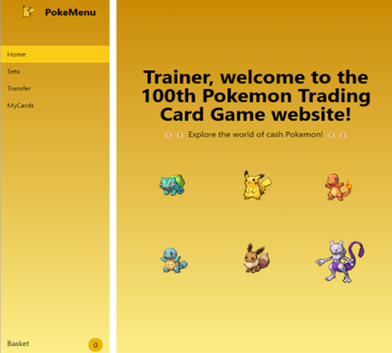
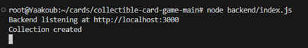
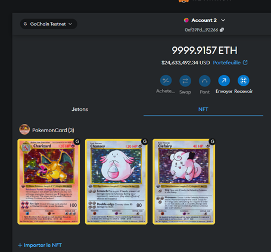

# I. Collectible Card Game

Our "Collectible Card Game" project is a decentralized collectible card game (CCG) built on the Ethereum blockchain. Players can own, trade, and collect unique cards as NFTs (Non-Fungible Tokens), giving each player immutable proof of ownership on the blockchain. This decentralized approach ensures that each card is unique and traceable, providing transparency and security in ownership.

<div align="center">
    
</div>

## Authors

- Rania KABTANE
- Yaakoub MOUSSOUNI


This project includes three main components:
1. **Backend** - Manages off-chain data and coordinates player actions, interacts with Ethereum smart contracts for blockchain transactions.
2. **Frontend** - User interface where players manage collections, view cards, and perform trades. It also connects to Ethereum wallets (e.g., Metamask) for blockchain interactions.
3. **Smart Contracts** - Manages card creation, ownership, and trading on the Ethereum blockchain using Solidity.

# II. Demo
<div align="center">
  <a href="https://www.youtube.com/watch?v=2JTXBozTcuM">
    
  </a>
</div>
# III. Installation

### Pokémon TCG API Integration
To enrich the gaming experience, we use the [Pokémon TCG API](https://pokemontcg.io/), importing popular Pokémon cards for recognizable and collectible content. 

**Steps for Integration**:
1. Configure the backend with a script to retrieve data from the Pokémon TCG API using an API key.
2. Serve detailed card metadata to the frontend.
You’ll need to install dependencies. You’ll need HardHat, Node.js, NPM, and Yarn. You’ll need to install Metamask as well to communicate with your blockchain.

HardHat is a local blockchain development tool, allowing you to iterate quickly and avoid wasting Ether during development. Fortunately, you have nothing to do to install it.
Node.js is used to build the frontend and run Truffle, which is a utility to deploy contracts.
NPM or Yarn is a package manager used to install dependencies for your frontend development. Yarn is recommended.
Metamask is a browser utility to interact with decentralized applications.

# IV. Features

- **Decentralized Trading**: Players can mint and trade cards in a marketplace without intermediaries.
- **User-Generated Cards**: Players can create custom cards, mint them as NFTs, and trade within the platform.
- **In-App Purchases**: Players can buy card packs, boost collections, or access premium features for enhanced gameplay.

# V. Getting Started
Prerequisites
Node.js and Yarn
Hardhat (for local blockchain development)
Metamask (for wallet connectivity)
API key from Pokémon TCG API

### Installation

 **Clone the Repository**
   ```bash
   git clone https://github.com/Yaakoubmoussouni/daar.git
   cd collectible-card-game
   ```

You should have a local blockchain running. Open Metamask, set it up, and add an account from the private keys that HardHat displays. Now you can connect Metamask to the blockchain. To do this, add a network by clicking on Ethereum Mainnet and personalized RPC. Here, you should be able to add a network.

Installation
Install the dependencies.
```bash
###Yarn Users
yarn
```
Run the complete project.
```bash
###Yarn Users
yarn dev
```
```bash
### API listens on port 3000
node backend/index.js
```

<div align="center">
    
</div>


You’re good to go!

Usage
Open the application in your browser at http://localhost:5173/.
Connect your Metamask wallet.
Use the app to create collections, mint new cards, and view your inventory.

<div align="center">
    
</div>

# VI. Future Development


Decentralized Marketplace: A peer-to-peer marketplace for trading and selling cards.
Player-Created Cards: Allow users to design and mint custom cards.
Premium Purchases: Enable players to buy packs, boost collections, or access exclusive content.


# VII. Conclusion 


This project allowed us to explore decentralized application development, creating a unique experience with ERC-721 NFTs on Ethereum.

By integrating the Pokémon TCG API, we enhanced user engagement with familiar content.

Developing both the frontend with Metamask connectivity and a backend API enriched our skills in building hybrid architectures that interact smoothly with blockchain.

# VIII. References


Alina Novikova & Shuhan Duan. Collectible Card Game Project Repository, GitHub. Available at: https://github.com/JerryProject/collectible-card-game-daar-inspi/tree/main.

CryptoZombies. Learn to Code Blockchain DApps by Building Simple Games. Available at: https://cryptozombies.io/.

Solidity Documentation. Solidity 0.8.28 Documentation. Available at: https://docs.soliditylang.org/en/v0.8.28/.

Pokémon TCG Developers. Pokémon TCG API Documentation. Available at: https://pokemontcg.io/.
